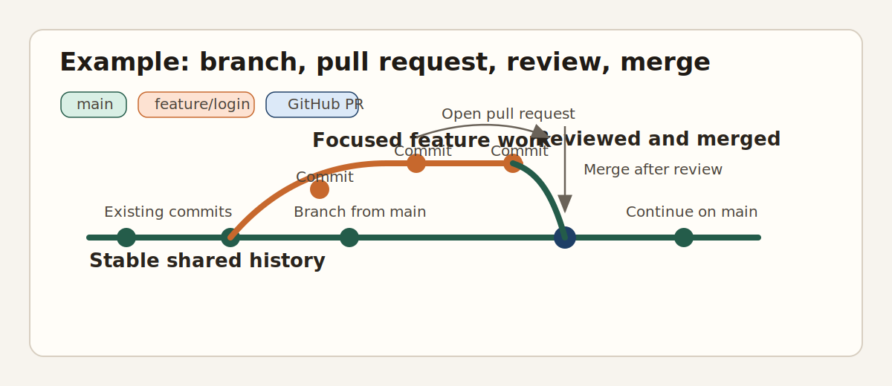

# GitGuide

A shared Git and GitHub ramp-up guide for collaborators who need a practical, common way of thinking about version control.

## Table of Contents

1. [Purpose](#purpose)
2. [Audience](#audience)
3. [Editorial Principles](#editorial-principles)
4. [Visual Example](#visual-example)
5. [A Shared Mental Model](#a-shared-mental-model)
6. [Git vs GitHub](#git-vs-github)
7. [Core Concepts](#core-concepts)
8. [Daily Workflow](#daily-workflow)
9. [Branches and Pull Requests](#branches-and-pull-requests)
10. [Merge and Rebase](#merge-and-rebase)
11. [Fixing Mistakes](#fixing-mistakes)
12. [Team Agreements](#team-agreements)
13. [Glossary](#glossary)
14. [Command Cheatsheet](#command-cheatsheet)
15. [Writing Strategy](#writing-strategy)
16. [Next Drafting Priorities](#next-drafting-priorities)

## Purpose

This project exists to reduce friction, not to document every Git command.

The guide should help collaborators:

- understand what Git is and what GitHub is
- build a shared mental model for branches, commits, pull requests, merges, and rebases
- follow a team workflow without having to memorize advanced internals first
- recover from common mistakes without panic

## Audience

This guide is for people who:

- are new to Git and GitHub
- have used Git before but still feel uncertain
- need a common vocabulary with teammates
- care more about safe daily collaboration than about mastering every edge case

## Editorial Principles

- Explain concepts in plain language before showing commands.
- Prefer mental models over memorization.
- Teach the day-to-day workflow first, then the exceptions.
- Standardize team vocabulary where ambiguity causes confusion.
- Keep the guide practical: "what it is", "why it matters", "what to do".

## Visual Example

<p align="center">
  
</p>

<p align="center">
  A simple picture of the workflow this guide is trying to teach.
</p>

## A Shared Mental Model

Most Git confusion comes from people using the same words to mean different things.

This guide uses one shared model:

- Git is a version control system that tracks the history of a project.
- Git stores project history as snapshots, not as "documents with tracked changes".
- A commit is a saved snapshot with history attached to it.
- A branch is a movable label that usually points to the latest commit in a line of work.
- A remote is another copy of the same repository, often hosted on GitHub.
- GitHub is a collaboration platform built around Git repositories.

### Recommended Framing

If this project is for teammates, lead with these ideas:

- Git helps us work safely without overwriting each other's work.
- GitHub helps us discuss, review, and integrate changes together.
- Branches are not "separate projects"; they are separate lines of work.
- Pull requests are not just buttons to click; they are review units.

### Common Misunderstandings To Address

- "Git and GitHub are the same thing."
- "A branch is a copy of the whole project forever."
- "A commit is the same as pushing."
- "Pull means merge, fetch, and sync in every context."
- "Rebase is always dangerous."

### What This Section Should Explain

- why version control matters
- why Git feels hard at first
- what the main moving parts are
- what happens locally versus on GitHub

## Git vs GitHub

This distinction should be explicit because many workflow misunderstandings start here.

### Git

Git is the version control system running on your machine and in repositories shared with others.

Git is responsible for:

- tracking changes
- recording commits
- managing branches
- merging or rebasing history
- syncing history between repositories

### GitHub

GitHub is the hosting and collaboration layer around Git repositories.

GitHub is responsible for:

- repository hosting
- pull requests
- code review discussions
- branch protection and permissions
- issue tracking and project coordination

### Simple Rule Of Thumb

- If you are manipulating history, branches, commits, or sync behavior, that is Git.
- If you are discussing, reviewing, approving, or managing collaboration around changes, that is usually GitHub.

### Why This Matters

People often blame Git for problems that are really workflow or platform issues, and vice versa.

Examples:

- a merge conflict is a Git problem
- an approval rule is a GitHub policy
- a force-push is a Git action with team policy implications
- a pull request review comment is a GitHub discussion attached to Git commits

## Core Concepts

This section defines the minimum vocabulary the team uses consistently.

### Working Tree

Your working tree is the set of files currently checked out on your machine.

### Staging Area

The staging area is where you prepare exactly what will go into the next commit.

This concept deserves extra care because many beginners skip it mentally and then do not understand why commits contain certain changes.

### Commit

A commit is a saved snapshot of staged changes, along with metadata such as author, timestamp, and message.

### Branch

A branch is a name pointing to a line of commits.

Useful phrasing for beginners:

- a branch is lightweight
- a branch moves forward as new commits are added
- switching branches changes which line of work your files reflect

### Remote

A remote is another repository Git can communicate with, such as `origin`.

### Push And Pull

- `push` sends local commits to a remote repository
- `pull` updates your local branch from a remote branch, usually by fetching and then integrating changes

### Pull Request

A pull request is a GitHub request to review and merge one branch into another.

### Recommended Teaching Order

1. working tree
2. staging area
3. commit
4. branch
5. remote
6. push and pull
7. pull request

## Daily Workflow

This should be the operational center of the guide.

If teammates remember only one section, it should probably be this one.

### Baseline Workflow

1. Start from the latest shared branch, usually `main`.
2. Create a branch for one focused piece of work.
3. Make changes locally.
4. Stage and commit meaningful progress.
5. Push the branch to GitHub.
6. Open a pull request.
7. Discuss feedback and update the branch.
8. Merge when approved.
9. Sync your local `main` again before starting the next piece of work.

### Why This Workflow Works

- work stays isolated until ready for review
- changes are easier to understand when scoped
- review happens before integration
- shared history stays more reliable

### Good Habits To Teach

- keep branches short-lived
- keep pull requests focused
- write commit messages that explain intent
- pull or fetch before assuming you are up to date
- treat `main` as protected shared history

### Questions This Section Should Answer

- when should I branch
- how often should I commit
- when should I push
- when do I open a pull request
- what do I do after review feedback

## Branches and Pull Requests

This section connects the Git side of collaboration with the GitHub side.

### Branches

Branches let people work in parallel without immediately affecting the shared branch.

For beginners, emphasize:

- a branch is cheap to create
- a branch should usually represent one task or change set
- long-lived branches increase drift and confusion

### Pull Requests

Pull requests give the team a structured place to review, discuss, and approve changes before merging.

Useful framing:

- the branch contains the work
- the pull request contains the conversation around that work

### What A Good Pull Request Usually Has

- a clear title
- a concise summary of what changed
- enough context for reviewers to understand why
- a manageable scope
- notes about risks, testing, or follow-up work

### Review Norms To Consider Standardizing

- review for correctness before style
- ask questions when intent is unclear
- keep feedback specific and actionable
- prefer small pull requests over large batches

## Merge and Rebase

This section should remove fear, not just define commands.

### Merge

Merging combines histories by creating a merge commit when needed.

Good beginner framing:

- merge preserves the shape of parallel history
- merge is often the simpler mental model

### Rebase

Rebasing replays commits onto a new base so history appears as if the work started from a later point.

Good beginner framing:

- rebase changes commit history
- rebase can make history cleaner
- rebase requires more care than merge

### Recommended Team Guidance

If your team wants a simple default, this is a reasonable position:

- use pull requests to merge reviewed work into `main`
- allow local rebasing to keep a feature branch current
- avoid rebasing branches that other people are actively using unless everyone understands the consequences

### What This Section Should Clarify

- when merge is the safer choice
- when rebase is helpful
- why force-push may appear after a rebase
- why "clean history" and "safe collaboration" need to be balanced

## Fixing Mistakes

This section is important because fear of mistakes is one of the main reasons Git feels stressful.

### Principle

Teach people to identify what kind of thing they want to undo:

- unstaged local changes
- staged changes
- the last commit
- a pushed commit
- a bad merge
- a conflict during integration

The safest recovery path depends on which layer the mistake lives in.

### Practical Topics To Cover

- how to unstage changes
- how to discard local changes intentionally
- how to amend the last commit
- how to revert a commit safely after push
- how to resolve merge conflicts
- when to stop and ask for help before rewriting shared history

### Tone Recommendation

This section should be calm and explicit.

Avoid saying things like "just reset it" without context. For beginners, that wording often hides risk.

## Team Agreements

This section should become your team's source of truth for workflow decisions.

Without this, people may understand Git individually but still collaborate inconsistently.

### Decisions Worth Making Explicit

- which branch is the default protected branch
- whether work always happens through pull requests
- whether merge commits, squash merges, or rebases are preferred
- whether force-push is allowed on personal branches
- how branch names should look
- how commit messages should look
- what reviewers are expected to check
- when a pull request is ready for review

### Example Agreements

These are starter defaults, not mandatory answers:

- `main` is the protected branch
- direct pushes to `main` are not allowed
- each task gets its own branch
- pull requests should stay focused on one topic
- squash merge is preferred for small, self-contained work
- force-push is allowed only on your own branch and only when no one else depends on it

### Why This Section Matters

Many Git problems in teams are really policy ambiguity problems.

When people say "Git is confusing", they often mean:

- I do not know what our team expects
- I do not know which history style we prefer
- I do not know what is safe versus merely possible

## Glossary

Use this section to standardize terms that are often used loosely.

### Branch

A named pointer to a line of commits.

### Commit

A saved snapshot of staged changes and related metadata.

### Fetch

Download new history from a remote without integrating it into the current branch.

### Merge

Combine histories from different branches.

### Pull

Update a local branch from a remote branch, usually by fetching and then integrating changes.

### Pull Request

A GitHub request to review and merge one branch into another.

### Push

Send local commits to a remote repository.

### Rebase

Replay commits onto a new base, rewriting commit history in the process.

### Remote

Another Git repository your local repository can communicate with.

### Staging Area

The area where changes are selected for inclusion in the next commit.

### Working Tree

The currently checked-out files on your machine.

## Command Cheatsheet

This section should stay secondary to the conceptual sections.

Commands make more sense after the workflow is clear.

### Start New Work

```bash
git switch main
git pull
git switch -c my-topic-branch
```

### Save Progress

```bash
git status
git add .
git commit -m "Describe the change"
```

### Share Work

```bash
git push -u origin my-topic-branch
```

### Update Your Branch

```bash
git fetch origin
git merge origin/main
```

Alternative if your team is comfortable with rebase:

```bash
git fetch origin
git rebase origin/main
```

### Inspect State

```bash
git status
git log --oneline --graph --decorate
git diff
```

### Fix Simple Mistakes

```bash
git restore .
git restore --staged .
git commit --amend
git revert <commit>
```

### Note

When you expand this cheatsheet, keep each command tied to a scenario and a risk level. That makes it more useful than a flat list.

## Writing Strategy

The best version of this guide will probably not read like a textbook. It should read like an onboarding companion:

- start with "what is happening"
- then show "what we do on this team"
- then show "what to do when something goes wrong"

That sequence reduces anxiety better than starting with low-level internals.

## Next Drafting Priorities

- write the shared mental model in your own language
- decide your team's preferred workflow before writing detailed command examples
- add screenshots only after the terminology is stable
- keep examples small and realistic
